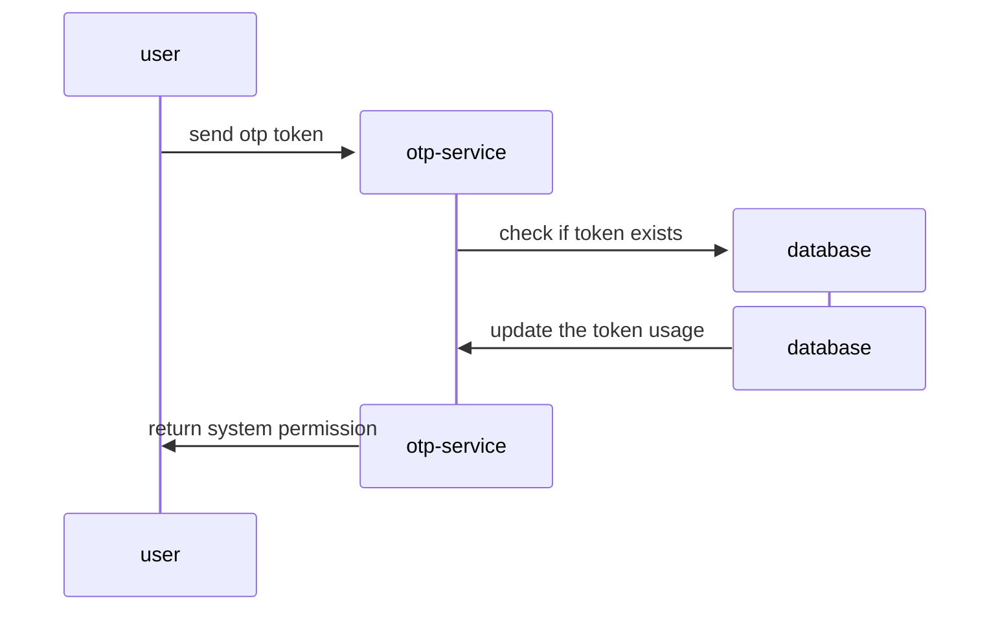

## Description

Service to create and validate OTP tokens

## Project setup

```bash
$ yarn install
```

## Compile and run the project

```bash
# watch mode
$ docker compose up app
```

## Run tests

```bash
# unit tests
$ yarn run test

# e2e tests
$ docker compose up test

# test coverage
$ yarn run test:cov
```

## Devlopment documentation

### Commit structure

[Conventional Commits](https://www.conventionalcommits.org/en/v1.0.0/)

### File structure

Following the default nestjs structure. To create a new module follow the [Nest module CLI DOC](https://docs.nestjs.com/modules)

### Getting an OTP Token


### Checking an OTP Token




## License

This project is [MIT licensed](https://github.com/nestjs/nest/blob/master/LICENSE).
